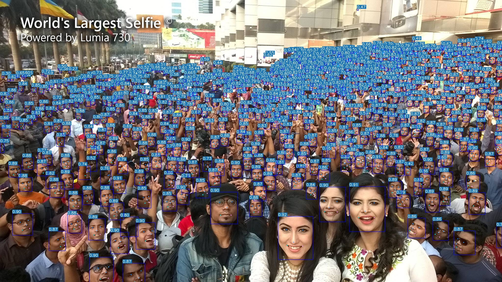

# yolov7-face

### New feature

* Dynamic keypoints
* WingLoss
* Efficient backbones
* EIOU and SIOU

| Method           |  Test Size | Easy  | Medium | Hard  | FLOPs (B) @640 | Link  |
| -----------------| ---------- | ----- | ------ | ----- | -------------- | ----- |
| yolov7-lite-t    | 640        | 88.7  | 85.2   | 71.5  |  0.8           | [google](https://drive.google.com/file/d/1HNXd9EdS-BJ4dk7t1xJDFfr1JIHjd5yb/view?usp=sharing) |
| yolov7-lite-s    | 640        | 92.7  | 89.9   | 78.5  |  3.0           | [google](https://drive.google.com/file/d/1MIC5vD4zqRLF_uEZHzjW_f-G3TsfaOAf/view?usp=sharing) |
| yolov7-tiny      | 640        | 94.7  | 92.6   | 82.1  |  13.2          | [google](https://drive.google.com/file/d/1Mona-I4PclJr5mjX1qb8dgDeMpYyBcwM/view?usp=sharing) |
| yolov7s          | 640        | 94.8  | 93.1   | 85.2  |  16.8          | [google](https://drive.google.com/file/d/1_ZjnNF_JKHVlq41EgEqMoGE2TtQ3SYmZ/view?usp=sharing) |
| yolov7           | 640        | 96.9  | 95.5   | 88.0  |  103.4         | [google](https://drive.google.com/file/d/1oIaGXFd4goyBvB1mYDK24GLof53H9ZYo/view?usp=sharing) |
| yolov7+TTA       | 640        | 97.2  | 95.8   | 87.7  |  103.4         | [google](https://drive.google.com/file/d/1oIaGXFd4goyBvB1mYDK24GLof53H9ZYo/view?usp=sharing) |
| yolov7-w6        | 960        | 96.4  | 95.0   | 88.3  |  89.0          | [google](https://drive.google.com/file/d/1U_kH7Xa_9-2RK2hnyvsyMLKdYB0h4MJS/view?usp=sharing) |
| yolov7-w6+TTA    | 1280       | 96.9  | 95.8   | 90.4  |  89.0          | [google](https://drive.google.com/file/d/1U_kH7Xa_9-2RK2hnyvsyMLKdYB0h4MJS/view?usp=sharing) |

#### Dataset

[WiderFace](http://shuoyang1213.me/WIDERFACE/)

[yolov7-face-label](https://drive.google.com/file/d/1FsZ0ACah386yUufi0E_PVsRW_0VtZ1bd/view?usp=sharing)

#### Test

#### Demo

* [ncnn_Android_face](https://github.com/FeiGeChuanShu/ncnn_Android_face)

* [yolov7-detect-face-onnxrun-cpp-py](https://github.com/hpc203/yolov7-detect-face-onnxrun-cpp-py)

#### References

* [https://github.com/deepcam-cn/yolov5-face](https://github.com/deepcam-cn/yolov5-face)

* [https://github.com/WongKinYiu/yolov7](https://github.com/WongKinYiu/yolov7)

* [https://github.com/TexasInstruments/edgeai-yolov5/tree/yolo-pose](https://github.com/TexasInstruments/edgeai-yolov5/tree/yolo-pose)

* [https://github.com/ppogg/YOLOv5-Lite](https://github.com/ppogg/YOLOv5-Lite)
